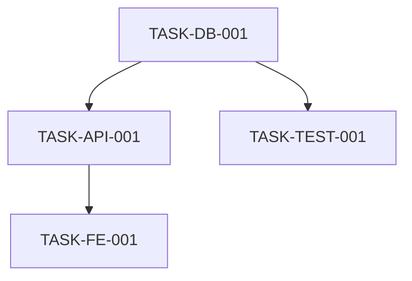

# Project Specification

**Project ID:** `[PROJECT-ID]`  
**Version:** `1.0.0`  
**Date:** `[DATE]`  
**Status:** `Draft | Under Review | Approved`  
**Owner:** `@[GITHUB-USERNAME]`

---

## Executive Summary

**Purpose:** [Brief description of what this project aims to achieve]

**Scope:** [What is included and explicitly excluded]

**Success Criteria:** [How we'll know this project succeeded]

**Key Stakeholders:** [List of primary stakeholders and their interests]

---

## 2. COMPLETE TASK BREAKDOWN

> **CRITICAL:** This section enumerates EVERY task required for implementation.
> Zero tasks can be implicit. Each task must be atomic (<5 minutes for AI agents).

### Task Manifest
**Total Tasks:** `[COUNT]`  
**Estimated Duration:** `[DURATION]` minutes  
**Critical Path Tasks:** `[COUNT]`

### Task Categories

#### Database Tasks
- **TASK-DB-001:** Create User model with fields [id, email, password_hash, created_at]
  - **Dependencies:** None
  - **Acceptance:** Model passes validation, migrations generated
  - **Risk:** Low
  - **Estimated:** 2 mins
  - **Libraries:** sqlalchemy
  - **Related Requirements:** REQ-F-001

- **TASK-DB-002:** [Next database task]
  - [Continue pattern...]

#### API Tasks
- **TASK-API-001:** [API task description]
  - [Complete details...]

#### Frontend Tasks
- **TASK-FE-001:** [Frontend task description]
  - [Complete details...]

#### Testing Tasks
- **TASK-TEST-001:** [Testing task description]
  - [Complete details...]

#### Infrastructure Tasks
- **TASK-INFRA-001:** [Infrastructure task description]
  - [Complete details...]

### Task Dependency Graph



### Critical Path Analysis
Tasks on critical path (sequence determines minimum project duration):
1. TASK-DB-001 (2 mins)
2. TASK-API-001 (3 mins)
3. TASK-FE-001 (4 mins)
4. TASK-TEST-001 (2 mins)

**Total Critical Path Duration:** ~11 mins

### Parallel Execution Opportunities
**Phase 1** (No dependencies):
- TASK-DB-001
- TASK-INFRA-001

**Phase 2** (Depends on Phase 1):
- TASK-API-001
- TASK-API-002

**Phase 3** (Depends on Phase 2):
- TASK-FE-001
- TASK-TEST-001

### High-Risk Tasks
Tasks requiring extra attention:
- **TASK-API-003:** External API integration
  - **Risk:** High - Third-party dependency
  - **Mitigation:** Mock API for testing, circuit breaker pattern
  - **Fallback:** Local cache implementation

### Acceptance Criteria Table

| Task ID | Success Criteria | Verification Method |
|---------|------------------|---------------------|
| TASK-DB-001 | Model passes validation | `pytest tests/test_models.py::test_user_model` |
| TASK-API-001 | Endpoint returns 200 | `pytest tests/test_api.py::test_create_user` |
| TASK-FE-001 | UI renders correctly | `npm test -- components/UserForm.test.js` |

---

## 3. Functional Requirements

> Each requirement must be:
> - **Unique:** Has a unique ID (REQ-F-XXX)
> - **Testable:** Can be verified through testing
> - **Clear:** No ambiguous language
> - **Traceable:** Linked to source

### REQ-F-001: [Requirement Title]
**Priority:** High | Medium | Low  
**Source:** Issue #X, Comment, Derived  
**Description:** [Clear, unambiguous statement of what the system must do]  
**Acceptance Criteria:**
- [ ] Criterion 1
- [ ] Criterion 2
- [ ] Criterion 3

**Test Strategy:** [How this will be tested]

### REQ-F-002: [Next Requirement]
[Continue pattern...]

---

## Non-Functional Requirements

> Must be measurable with specific thresholds

### REQ-NF-001: Performance
**Description:** [Specific performance requirement]  
**Metric:** [e.g., Response time < 200ms at 95th percentile]  
**Test Method:** [How to measure]

### REQ-NF-002: Scalability
**Description:** [Specific scalability requirement]  
**Metric:** [e.g., Support 10,000 concurrent users]  
**Test Method:** [How to measure]

### REQ-NF-003: Reliability
**Description:** [Specific reliability requirement]  
**Metric:** [e.g., 99.9% uptime]  
**Test Method:** [How to measure]

### REQ-NF-004: Security
**Description:** [Specific security requirement]  
**Metric:** [e.g., Zero critical vulnerabilities in production]  
**Test Method:** [How to measure]

### REQ-NF-005: Maintainability
**Description:** [Specific maintainability requirement]  
**Metric:** [e.g., Test coverage > 80%]  
**Test Method:** [How to measure]

---

## User Stories with Acceptance Criteria

### US-001: [Story Title]
**As a** [role]  
**I want** [feature/capability]  
**So that** [benefit/value]

**Related Requirements:** REQ-F-001, REQ-F-002

**Acceptance Criteria:**
- [ ] Given [context], when [action], then [expected outcome]
- [ ] Given [context], when [action], then [expected outcome]
- [ ] Edge case: [description]
- [ ] Error handling: [description]

**Priority:** High | Medium | Low  
**Estimated Complexity:** Small | Medium | Large

### US-002: [Next Story]
[Continue pattern...]

---

## Data Dictionary

### Entity: [EntityName]
**Description:** [What this entity represents]

| Attribute | Type | Required | Constraints | Description |
|-----------|------|----------|-------------|-------------|
| id | UUID | Yes | Primary Key, Auto-generated | Unique identifier |
| name | String | Yes | Max 255 chars, Non-empty | Display name |
| status | Enum | Yes | [active, inactive, pending] | Current status |
| created_at | DateTime | Yes | ISO 8601, UTC | Creation timestamp |
| updated_at | DateTime | Yes | ISO 8601, UTC | Last update timestamp |

**Relationships:**
- One-to-many with [OtherEntity]
- Many-to-many with [AnotherEntity] via [JoinTable]

**Validation Rules:**
- Name must be unique within scope X
- Status transitions: [define state machine]

**Indexes:**
- Primary: id
- Secondary: name (unique)
- Composite: (status, created_at)

### Entity: [NextEntity]
[Continue pattern...]

---

## API Contracts (Draft)

### Endpoint: Create Resource
**Method:** `POST`  
**Path:** `/api/v1/resources`  
**Authentication:** Required (Bearer Token)  
**Authorization:** Role: [required_role]

**Request Body:**
```json
{
  "name": "string (required, max 255)",
  "description": "string (optional)",
  "attributes": {
    "key": "value"
  }
}
```

**Response (201 Created):**
```json
{
  "id": "uuid",
  "name": "string",
  "description": "string",
  "created_at": "ISO 8601 datetime",
  "status": "pending"
}
```

**Error Responses:**
- `400 Bad Request`: Invalid input data
- `401 Unauthorized`: Missing or invalid authentication
- `403 Forbidden`: Insufficient permissions
- `409 Conflict`: Resource already exists
- `422 Unprocessable Entity`: Validation failed

**Rate Limiting:** 100 requests per minute per user

### Endpoint: [Next Endpoint]
[Continue pattern...]

---

## UI/UX Requirements

> Include if project has user interface components

### Screen/Component: [Name]
**Purpose:** [What this interface accomplishes]

**Layout:**
- [Describe visual structure]
- [Key elements and their placement]

**Interactions:**
- [User action 1] → [System response]
- [User action 2] → [System response]

**Accessibility:**
- WCAG 2.1 Level AA compliance
- Keyboard navigation support
- Screen reader compatibility
- Color contrast ratios meet standards

**Responsive Design:**
- Mobile breakpoint: < 768px
- Tablet breakpoint: 768px - 1024px
- Desktop breakpoint: > 1024px

**Wireframes:** [Link to wireframes or embed]

---

## Security Requirements

### Authentication
**Method:** [e.g., OAuth 2.0, JWT, etc.]  
**Implementation:** [Specific details]  
**Session Management:** [Token expiry, refresh strategy]

### Authorization
**Model:** [RBAC, ABAC, etc.]  
**Roles:** [List roles and permissions]  
**Rules:** [Specific authorization rules]

### Data Protection
**At Rest:** [Encryption method, key management]  
**In Transit:** [TLS version, cipher suites]  
**PII Handling:** [Special requirements for personal data]

### Input Validation
**Strategy:** [Whitelist, sanitization approach]  
**Implementation:** [Where validation occurs]  
**XSS Prevention:** [Specific measures]  
**SQL Injection Prevention:** [Parameterized queries, ORM usage]

### Audit & Logging
**Events to Log:** [List security-relevant events]  
**Log Retention:** [Duration and storage]  
**Access Controls:** [Who can access logs]

### Compliance
**Standards:** [GDPR, HIPAA, SOC 2, etc.]  
**Requirements:** [Specific compliance requirements]

---

## Integration Requirements

### External System: [System Name]
**Purpose:** [Why we're integrating]  
**Protocol:** [REST, GraphQL, gRPC, etc.]  
**Authentication:** [How we authenticate]  
**Data Flow:** [What data goes where]  
**Error Handling:** [Retry strategy, circuit breakers]  
**SLA Requirements:** [Expected availability, response time]

### External System: [Next System]
[Continue pattern...]

---

## Constraints & Assumptions

### Technical Constraints
- [Constraint 1: e.g., Must use Python 3.9+]
- [Constraint 2: e.g., Must deploy on AWS]
- [Constraint 3: e.g., Database size limit of 10GB]

### Business Constraints
- [Constraint 1: e.g., Budget limit of $X]
- [Constraint 2: e.g., Must launch by Q2 2024]
- [Constraint 3: e.g., Team size limited to Y developers]

### Assumptions
- [Assumption 1: e.g., Users have modern browsers]
- [Assumption 2: e.g., External API X will remain available]
- [Assumption 3: e.g., Traffic will grow linearly]

### Dependencies
- [Dependency 1: e.g., Requires completion of Project X]
- [Dependency 2: e.g., Requires API key from Provider Y]

---

## Glossary

| Term | Definition |
|------|------------|
| [Term 1] | [Clear definition] |
| [Term 2] | [Clear definition] |
| [Term 3] | [Clear definition] |

---

## Open Questions

> **CRITICAL:** This section must be empty (or removed) before specification is approved.
> All questions must be resolved or explicitly escalated to stakeholders.

### ~~Q1: [Question that was resolved]~~
**Resolution:** [How it was answered]  
**Decision:** [What was decided]  
**Date:** [When resolved]

---

## Approval

**Reviewed By:**
- [ ] Product Owner: @[username] - Business requirements approval
- [ ] Technical Lead: @[username] - Technical feasibility approval
- [ ] Security Lead: @[username] - Security requirements approval
- [ ] QA Lead: @[username] - Testability approval

**Approval Date:** [DATE]  
**Next Review Date:** [DATE]

---

## Change History

| Version | Date | Author | Changes |
|---------|------|--------|---------|
| 1.0.0 | [DATE] | @[username] | Initial specification |

---

## Notes

[Any additional notes, references, or context that doesn't fit above categories]
