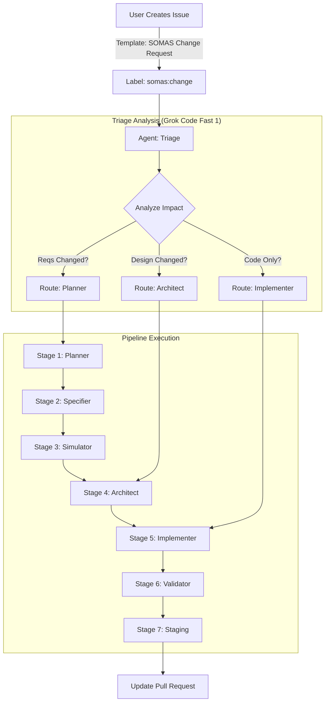

# SOMAS Change Request Workflow Guide

## Overview

The Change Request Workflow allows developers to modify in-progress SOMAS projects without restarting the entire pipeline. It utilizes a **Triage Agent** to intelligently route requests to the appropriate stage (Planning, Architecture, or Implementation), bypassing initial stages that are not relevant to the specific change.

## Workflow Diagram

## Step-by-Step Instructions

### 1. Triggering a Change

Instead of editing code manually or creating a new project, use the specific issue template:

1. **Navigate to Issues** > **New Issue**.
2. Select **🔄 SOMAS Change Request**.
3. **Fill out the form**:
    * **Related Project ID**: (e.g., `project-123`) - Critical for linking context.
    * **Change Type**: Scope addition, requirement mod, constraint change, etc.
    * **Description**: Be specific (e.g., "Add rate limiting to the API").
    * **Justification**: Why is this needed?
4. **Submit**: The issue is automatically labeled `somas:change`.

### 2. Triage & Routing (Autonomous)

The **Triage Agent** (running on Grok Code Fast 1) immediately analyzes the request against the existing project artifacts (`SPEC.md`, `ARCHITECTURE.md`).

It applies deterministic routing rules defined in `.somas/agents/triage.yml`:

| Condition | Target Agent | Entry Stage | Why? |
|-----------|--------------|-------------|------|
| **New/Modified Requirements** | **Planner** | Stage 1 | Needs spec update & re-simulation |
| **Architecture/Stack Change** | **Architect** | Stage 4 | Needs design update, spec is fine |
| **Bug Fix / Optimization** | **Implementer** | Stage 5 | Code change only, design is fine |

### 3. Execution Flow

The pipeline resumes execution from the **Entry Stage** determined by Triage.

#### Scenario A: Requirement Change (e.g., "Add User Auth")

1. **Triage** routes to **Planner**.
2. **Planner** updates `initial_plan.md`.
3. **Specifier** updates `SPEC.md` with new auth requirements.
4. **Simulator** re-runs to check if this adds critical path time.
5. **Architect** designs the auth flow.
6. **Implementer** writes the code.

#### Scenario B: Architecture Change (e.g., "Switch DB to Postgres")

1. **Triage** routes to **Architect**.
2. **Architect** updates `ARCHITECTURE.md` and `data_models.yml`.
3. **Implementer** refactors code to match new architecture.
4. **Validator** verifies the new backend.

#### Scenario C: Implementation Fix (e.g., "Fix off-by-one error")

1. **Triage** routes to **Implementer**.
2. **Implementer** applies the fix.
3. **Validator** runs tests to ensure fix works and no regressions.

### 4. Completion

Regardless of the entry point, the workflow converges at **Stage 7 (Staging)**.

* The existing Pull Request for the project is updated (or a new one created if the previous was merged).
* You will receive a notification to review the changes.

## Troubleshooting

### "Triage escalated to human"

* **Cause**: The Triage agent's confidence score was below 0.8. This happens if the request is ambiguous (e.g., "Make it better").
* **Fix**: A human maintainer will review the issue and manually trigger the correct stage using a comment command (e.g., `@copilot somas-architect start`).

### Change applied to wrong project

* **Cause**: Incorrect `Project ID` in the issue form.
* **Fix**: Close the change request and open a new one with the correct ID.

## Reference Files

* **Issue Template**: `.github/ISSUE_TEMPLATE/somas-change.yml`
* **Triage Logic**: `.somas/agents/triage.yml`
* **Orchestration**: `.github/workflows/somas-orchestrator.yml`
