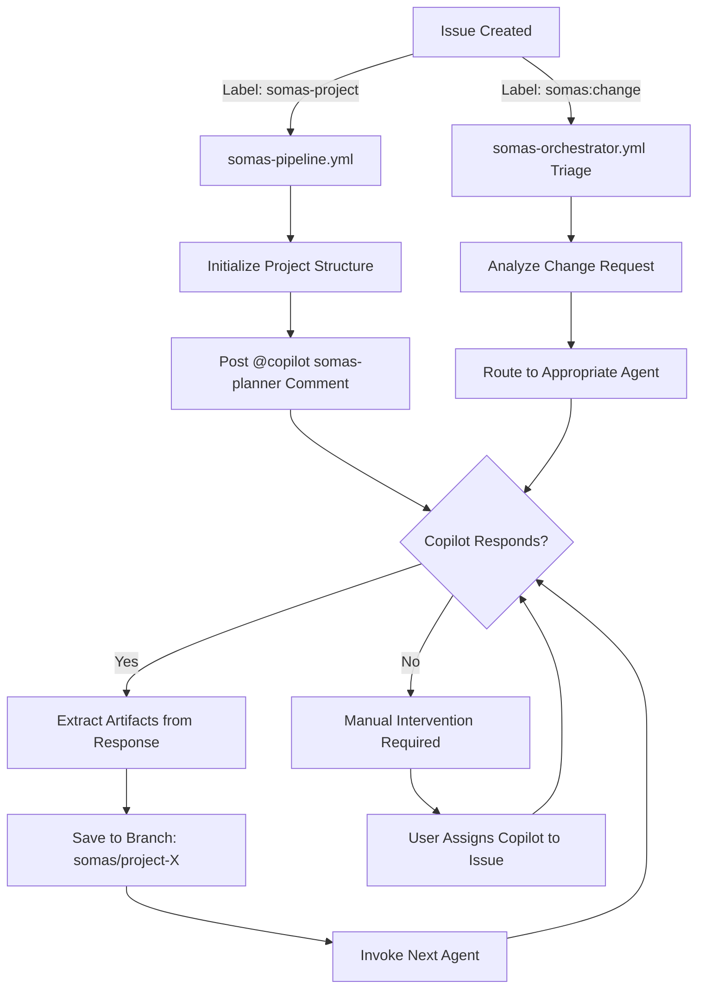

# GitHub Copilot Custom Agents + SOMAS Workflow Integration

## Table of Contents
- [Overview](#overview)
- [Current Architecture](#current-architecture)
- [Agent Ecosystem](#agent-ecosystem)
- [Workflow Integration Patterns](#workflow-integration-patterns)
- [Autonomous Execution for New Issues](#autonomous-execution-for-new-issues)
- [Limitations and Workarounds](#limitations-and-workarounds)
- [Implementation Guide](#implementation-guide)
- [Troubleshooting](#troubleshooting)

---

## Overview

SOMAS uses **17 specialized GitHub Copilot custom agents** (invoked via `@copilot somas-<agent>`) to execute the 11-stage Aether Lifecycle pipeline. This document explains how these agents integrate with GitHub Actions workflows to enable autonomous development.

### Design Goals

1. **Autonomous Execution**: Minimal human intervention from issue creation to PR merge
2. **Comment-Driven Orchestration**: Agents communicate via issue comments
3. **Artifact Chain**: Each agent produces artifacts consumed by the next agent
4. **Type-Specific Routing**: Different handling for project vs. change requests

---

## Current Architecture

### Agent Definition Structure

```
.github/agents/
├── README.md                    # Agent catalog and usage guide
├── agents-index.json            # Machine-readable agent registry
├── somas-planner.md             # Stage 1: Ideation
├── somas-specifier.md           # Stage 2: Specification
├── somas-simulator.md           # Stage 3: Simulation
├── somas-architect.md           # Stage 3: Architecture
├── somas-decomposer.md          # Stage 4: Decomposition
├── somas-implementer.md         # Stage 5: Implementation
├── somas-tester.md              # Stage 6: Testing
├── somas-merger.md              # Stage 7: Integration
├── somas-security.md            # Cross-cutting: Security
├── somas-reviewer.md            # Cross-cutting: Code Review
├── somas-documenter.md          # Cross-cutting: Documentation
├── somas-orchestrator.md        # Coordination
└── somas-advisor.md             # Strategic guidance
```

Each agent file contains:
- **YAML frontmatter**: Name, description, config file path
- **Role definition**: Responsibilities and scope
- **Input/output specifications**: Expected artifacts
- **Integration instructions**: How to invoke and use the agent
- **Example invocations**: Common usage patterns

### Workflow Orchestration Flow



---

## Agent Ecosystem

### Pipeline Agents (Sequential)

| Stage | Agent | Input | Output | Model |
|-------|-------|-------|--------|-------|
| 1. INTAKE | `@copilot somas-triage` | Issue body | Routing decision | GPT-4o |
| 1. SIGNAL | `@copilot somas-planner` | Project idea | `initial_plan.yml` | GPT-4o |
| 2. DESIGN | `@copilot somas-specifier` | `initial_plan.yml` | `SPEC.md` | GPT-4o |
| 3. GRID | `@copilot somas-simulator` | `SPEC.md` | `execution_plan.yml` | GPT-4o |
| 3. GRID | `@copilot somas-architect` | `SPEC.md` + `execution_plan.yml` | `ARCHITECTURE.md` | GPT-4o |
| 4. LINE | `@copilot somas-decomposer` | `ARCHITECTURE.md` | Task checklist | GPT-4o |
| 5. MCP | `@copilot somas-implementer` | Tasks + Architecture | Source code | GPT-4o |
| 6. PULSE | `@copilot somas-tester` | Source code + SPEC | Test suite | GPT-4o |
| 7. SYNAPSE | `@copilot somas-merger` | Multiple branches | Merged code | GPT-4o |
| 8. HARDEN | `@copilot somas-security` | Implementation | Security audit | GPT-4o |
| 9. VELOCITY | `@copilot somas-deployer` | Validated code | Deployment config | GPT-4o |

### Cross-Cutting Agents (Parallel)

| Agent | Role | Invocation Timing |
|-------|------|-------------------|
| `@copilot somas-reviewer` | Code quality review | Any PR/commit |
| `@copilot somas-documenter` | Documentation generation | Post-implementation |
| `@copilot somas-orchestrator` | Pipeline coordination | Stage transitions |
| `@copilot somas-advisor` | Strategic decisions | Complex problems |

---

## Workflow Integration Patterns

### Pattern 1: Comment-Driven Orchestration (Current)

**File:** `.github/workflows/somas-orchestrator.yml`

#### How It Works

1. **Trigger**: `issue_comment.created` event
2. **Filter**: Only process comments from `copilot[bot]` user containing `@copilot somas-`
3. **Parse Response**: Extract YAML/Markdown code blocks using regex
4. **Save Artifacts**: Commit to branch `somas/project-{issue_number}`
5. **Invoke Next Agent**: Post comment mentioning next agent

#### Example Flow

```yaml
# Orchestrator detects: Last human comment mentions @copilot somas-planner
# Action: Post invocation comment

- name: Invoke Planner Agent
  uses: actions/github-script@v7
  with:
    script: |
      await github.rest.issues.createComment({
        owner: context.repo.owner,
        repo: context.repo.repo,
        issue_number: issueNumber,
        body: `## Stage 1/11 - SIGNAL (Ideation)
        
        @copilot somas-planner
        
        Please analyze the project request and create an initial plan.
        
        **Input:**
        - Issue #${issueNumber}: ${issueTitle}
        - Project idea: [see issue body]
        
        **Required Output:**
        Provide a YAML code block with:
        \`\`\`yaml
        project_id: project-${issueNumber}
        title: "..."
        features:
          - feature1
          - feature2
        # ... (see template)
        \`\`\`
        
        **Reference:** See \`.somas/templates/initial_plan.yml\` for format.`
      });
```

#### Response Parsing

```javascript
// When Copilot responds with:
// ```yaml
// project_id: project-123
// title: "Chat Application"
// ...
// ```

const yamlMatch = body.match(/```yaml\n([\s\S]*?)\n```/);
if (yamlMatch) {
  const artifactContent = yamlMatch[1];
  // Save to: projects/project-123/artifacts/initial_plan.yml
}
```

#### Next Agent Invocation

```javascript
// After saving artifact, determine next agent
if (lastHumanComment.includes('@copilot somas-planner')) {
  nextAgent = 'specifier';
  requiredArtifact = 'initial_plan.yml';
} else if (lastHumanComment.includes('@copilot somas-specifier')) {
  nextAgent = 'simulator';
  requiredArtifact = 'SPEC.md';
}

// Post comment invoking next agent
await github.rest.issues.createComment({
  body: `@copilot somas-${nextAgent}\n\nInput: ${requiredArtifact}\n...`
});
```

---

### Pattern 2: Direct Workflow Dispatch (Alternative)

**File:** `.github/workflows/somas-dev-autonomous.yml`

#### How It Works

1. **Trigger**: Issue labeled with `somas:dev`
2. **Action**: Execute entire pipeline in single workflow run
3. **Agent Invocation**: Via `somas/core/runner.py` (Python script)
4. **Artifact Storage**: Direct git commits, no comment parsing

#### Key Differences

| Aspect | Comment-Driven | Workflow Dispatch |
|--------|----------------|-------------------|
| **Trigger** | Copilot comment | Label added |
| **Execution** | Async (multi-workflow) | Sync (single workflow) |
| **Agent Calls** | Via @mentions | Via Python runner |
| **Artifacts** | Parsed from comments | Direct API responses |
| **Human Intervention** | After each stage | Only at end |
| **GitHub Copilot Dependency** | Required | Optional (can use direct APIs) |

#### Limitation

**Python runner (`somas/core/runner.py`) currently uses placeholder logic:**

```python
# Current implementation (simplified)
def invoke_agent(agent_name, context):
    """
    TODO: Implement direct LLM API integration
    Currently relies on comment-driven orchestration
    """
    # Would need:
    # - OpenAI API client
    # - Anthropic API client
    # - Agent prompt templates
    # - Response parsing
    pass
```

**To enable full autonomy, need:**
1. Add OpenAI/Anthropic SDK dependencies
2. Load agent prompts from `.github/agents/*.md`
3. Make API calls with context
4. Parse and save responses directly

---

## Autonomous Execution for New Issues

### Use Case 1: New Project Issue

**Template:** `.github/ISSUE_TEMPLATE/somas-project.yml`

**Expected Flow:**

```
1. User creates issue with "somas-project" label
   ↓
2. Workflow: somas-pipeline.yml triggers
   ↓
3. Initialize project structure:
   - Create: .somas/projects/project-{issue_number}/
   - Create: Branch somas/project-{issue_number}
   ↓
4. Post invocation comment for @copilot somas-planner
   ↓
5. [BLOCKER] Copilot doesn't auto-respond to @mentions
   ↓
6. [WORKAROUND] Manual assignment or direct API call required
   ↓
7. Copilot responds with initial_plan.yml
   ↓
8. Orchestrator detects response, extracts artifact
   ↓
9. Post invocation for @copilot somas-specifier
   ↓
10. Repeat for all 11 stages...
   ↓
11. Final PR created with all artifacts
```

**Current Gap:** Step 6 - No automatic Copilot response without manual assignment

### Use Case 2: Change Request Issue

**Template:** `.github/ISSUE_TEMPLATE/somas-change.yml`

**Expected Flow:**

```
1. User creates issue with "somas:change" label
   ↓
2. Workflow: somas-orchestrator.yml triage job triggers
   ↓
3. Triage agent analyzes change request:
   - Scope addition → Route to PLANNER
   - Requirement modification → Route to SPECIFIER
   - Architecture change → Route to ARCHITECT
   - Implementation fix → Route to IMPLEMENTER
   ↓
4. Add appropriate stage label (e.g., "stage:design")
   ↓
5. Post invocation comment for determined agent
   ↓
6. [BLOCKER] Same Copilot non-response issue
   ↓
7. [WORKAROUND] Manual assignment required
   ↓
8. Agent responds with impact analysis + updated artifacts
   ↓
9. Apply changes to existing project branch
   ↓
10. Re-run affected downstream stages
```

**Current Gap:** 
- Triage logic exists but doesn't auto-advance to execution
- Change injection not fully implemented
- Re-execution of affected stages not automated

---

## Limitations and Workarounds

### Limitation 1: GitHub Copilot Non-Responsiveness

**Problem:** GitHub Copilot doesn't automatically respond to `@copilot` mentions in issue comments.

**GitHub's Behavior:**
- Copilot only responds when **explicitly assigned** to an issue/PR
- Assignment must be done via UI or API call
- No webhook/workflow trigger for auto-assignment

**Workarounds:**

#### Option A: Manual Assignment (Current)
```markdown
After issue creation:
1. User manually assigns @copilot to the issue
2. Copilot becomes "aware" of the issue
3. Responds to subsequent @mentions
```

**Pros:** Simple, no code changes needed  
**Cons:** Breaks autonomy, requires human intervention

#### Option B: GitHub API Assignment (Potential)
```javascript
// In workflow after issue creation
await github.rest.issues.addAssignees({
  owner: context.repo.owner,
  repo: context.repo.repo,
  issue_number: issueNumber,
  assignees: ['copilot[bot]'] // May not work - needs testing
});
```

**Status:** Unverified - GitHub may not allow programmatic assignment of bots  
**Next Step:** Test if GitHub API allows assigning `copilot[bot]` user

#### Option C: Direct LLM API Integration (Recommended)
```python
# In somas/core/runner.py
import openai
import anthropic

def invoke_agent(agent_name, context):
    # Load agent prompt from .github/agents/{agent_name}.md
    prompt_template = load_agent_prompt(agent_name)
    
    # Determine provider (GPT-4o, Claude, etc.)
    provider = get_agent_provider(agent_name)
    
    if provider == "openai":
        response = openai.ChatCompletion.create(
            model="gpt-4o",
            messages=[
                {"role": "system", "content": prompt_template},
                {"role": "user", "content": context}
            ]
        )
    elif provider == "anthropic":
        response = anthropic.Anthropic().messages.create(
            model="claude-3-5-sonnet-20241022",
            messages=[{"role": "user", "content": context}]
        )
    
    return response.content
```

**Pros:** 
- Full autonomy, no Copilot dependency
- Faster execution (no comment roundtrip)
- Direct artifact generation

**Cons:** 
- Requires API keys (`OPENAI_API_KEY`, `ANTHROPIC_API_KEY`)
- Additional cost (outside GitHub Copilot subscription)
- Need to implement response parsing and validation

**Recommendation:** Implement Option C for true autonomous execution

---

### Limitation 2: No Project-Specific Routing

**Problem:** `somas-pipeline.yml` doesn't have dedicated logic for new project issues.

**Current Behavior:**
```yaml
jobs:
  initialize-pipeline:
    if: github.event_name == 'issues' && 
        contains(github.event.issue.labels.*.name, 'somas-project') && 
        !contains(github.event.issue.labels.*.name, 'somas:dev')
    # ... creates project structure but doesn't invoke agents
```

**Gap:** After initialization, workflow ends. No agent invocation chain starts.

**Needed:**
```yaml
jobs:
  initialize-pipeline:
    # ... existing setup ...
    
  invoke-initial-agent:
    needs: initialize-pipeline
    runs-on: ubuntu-latest
    steps:
      - name: Start Agent Chain
        run: |
          # Post comment invoking somas-planner
          # OR
          # Call runner.py to invoke agent directly
```

---

### Limitation 3: Change Request Handling Incomplete

**Problem:** Triage exists but doesn't route to execution.

**Current Triage Job:**
```yaml
triage:
  if: github.event.label.name == 'somas:change'
  steps:
    - name: Add Triaged Label
      # Marks as triaged, adds somas:dev label
    
    - name: Invoke Triage Agent
      # Posts @copilot somas-triage comment
      # But nothing happens after this...
```

**Gap:** No follow-up to actually execute the change.

**Needed:**
1. Triage agent responds with routing decision
2. Orchestrator parses response and routes to appropriate agent
3. Agent analyzes impact on existing project
4. Generates updated artifacts
5. Applies changes to existing branch
6. Re-triggers affected downstream stages

---

## Implementation Guide

### Phase 1: Enable Direct LLM Integration

#### Step 1: Add Dependencies

```bash
# Update requirements.txt
echo "openai>=1.0.0" >> requirements.txt
echo "anthropic>=0.18.0" >> requirements.txt
```

#### Step 2: Implement Agent Runner

**File:** `somas/core/agent_invoker.py` (new)

```python
"""
Direct LLM API integration for autonomous agent execution.
Replaces comment-driven orchestration with direct API calls.
"""
import os
import yaml
from pathlib import Path
from typing import Dict, Any, Optional

import openai
from anthropic import Anthropic

class AgentInvoker:
    def __init__(self):
        self.openai_client = openai.OpenAI(api_key=os.getenv("OPENAI_API_KEY"))
        self.anthropic_client = Anthropic(api_key=os.getenv("ANTHROPIC_API_KEY"))
        self.agents_dir = Path(".github/agents")
        self.config = self._load_config()
    
    def _load_config(self) -> Dict[str, Any]:
        """Load agent configuration from .somas/config.yml"""
        with open(".somas/config.yml") as f:
            return yaml.safe_load(f)
    
    def _load_agent_prompt(self, agent_name: str) -> str:
        """Load agent prompt from .github/agents/somas-{agent_name}.md"""
        agent_file = self.agents_dir / f"somas-{agent_name}.md"
        if not agent_file.exists():
            raise FileNotFoundError(f"Agent file not found: {agent_file}")
        
        content = agent_file.read_text()
        
        # Extract main content (skip YAML frontmatter)
        if content.startswith("---"):
            parts = content.split("---", 2)
            return parts[2].strip() if len(parts) > 2 else content
        return content
    
    def invoke_agent(
        self, 
        agent_name: str, 
        context: Dict[str, Any],
        project_id: str
    ) -> str:
        """
        Invoke an agent with given context.
        
        Args:
            agent_name: Agent to invoke (e.g., 'planner', 'specifier')
            context: Dictionary with input artifacts and requirements
            project_id: Project identifier (e.g., 'project-123')
        
        Returns:
            Agent response as string
        """
        # Load agent configuration
        agent_config = self.config['agents']['agent_configs'].get(agent_name, {})
        provider = agent_config.get('provider', 'copilot')
        model = self.config['agents']['providers'][provider]['model']
        
        # Load agent prompt
        system_prompt = self._load_agent_prompt(agent_name)
        
        # Construct user message
        user_message = self._build_context_message(context, project_id)
        
        # Make API call
        if provider in ['openai', 'copilot']:
            response = self._invoke_openai(model, system_prompt, user_message)
        elif provider == 'anthropic':
            response = self._invoke_anthropic(model, system_prompt, user_message)
        else:
            raise ValueError(f"Unknown provider: {provider}")
        
        return response
    
    def _build_context_message(self, context: Dict[str, Any], project_id: str) -> str:
        """Build context message from artifacts and requirements"""
        message_parts = [
            f"**Project ID:** {project_id}",
            "",
            "**Context:**"
        ]
        
        for key, value in context.items():
            if isinstance(value, Path) and value.exists():
                # Include file content
                message_parts.append(f"\n### {key} (from {value})")
                message_parts.append(f"```\n{value.read_text()}\n```")
            else:
                message_parts.append(f"- **{key}:** {value}")
        
        return "\n".join(message_parts)
    
    def _invoke_openai(self, model: str, system_prompt: str, user_message: str) -> str:
        """Invoke OpenAI API"""
        response = self.openai_client.chat.completions.create(
            model=model,
            messages=[
                {"role": "system", "content": system_prompt},
                {"role": "user", "content": user_message}
            ],
            temperature=0.3
        )
        return response.choices[0].message.content
    
    def _invoke_anthropic(self, model: str, system_prompt: str, user_message: str) -> str:
        """Invoke Anthropic API"""
        response = self.anthropic_client.messages.create(
            model=model,
            max_tokens=4096,
            system=system_prompt,
            messages=[{"role": "user", "content": user_message}]
        )
        return response.content[0].text
```

#### Step 3: Update Runner

**File:** `somas/core/runner.py` (modify)

```python
from somas.core.agent_invoker import AgentInvoker

class Runner:
    def __init__(self):
        self.invoker = AgentInvoker()
        # ... existing code
    
    def execute_stage(self, stage_name: str, project_id: str):
        """Execute a pipeline stage with direct agent invocation"""
        # Load stage config
        stage_config = self._load_stage_config(stage_name)
        agent_name = stage_config['agent']
        
        # Gather context (previous artifacts, etc.)
        context = self._gather_stage_context(stage_name, project_id)
        
        # Invoke agent
        response = self.invoker.invoke_agent(agent_name, context, project_id)
        
        # Parse and save artifacts
        artifacts = self._parse_artifacts(response, stage_config['outputs'])
        self._save_artifacts(artifacts, project_id)
        
        return artifacts
```

---

### Phase 2: Add Project Issue Handling

**File:** `.github/workflows/somas-pipeline.yml` (modify)

```yaml
jobs:
  initialize-pipeline:
    # ... existing initialization ...
    outputs:
      project_id: ${{ steps.setup.outputs.project_id }}
  
  # NEW JOB: Invoke agent chain
  execute-autonomous-pipeline:
    needs: initialize-pipeline
    runs-on: ubuntu-latest
    steps:
      - name: Checkout repository
        uses: actions/checkout@v4
        with:
          ref: somas/${{ needs.initialize-pipeline.outputs.project_id }}
      
      - name: Setup Python
        uses: actions/setup-python@v5
        with:
          python-version: "3.11"
      
      - name: Install Dependencies
        run: |
          pip install -r requirements.txt
          pip install openai anthropic
      
      - name: Execute Pipeline
        env:
          OPENAI_API_KEY: ${{ secrets.OPENAI_API_KEY }}
          ANTHROPIC_API_KEY: ${{ secrets.ANTHROPIC_API_KEY }}
          PROJECT_ID: ${{ needs.initialize-pipeline.outputs.project_id }}
        run: |
          python3 somas/core/runner.py \
            --mode autonomous \
            --project_id "$PROJECT_ID"
      
      - name: Commit Artifacts
        run: |
          git add .
          git commit -m "Autonomous execution for $PROJECT_ID"
          git push
      
      - name: Create Pull Request
        # ... create PR with all generated artifacts
```

---

### Phase 3: Add Change Request Routing

**File:** `.github/workflows/somas-orchestrator.yml` (modify triage job)

```yaml
triage:
  # ... existing triage steps ...
  
  # NEW STEP: Execute change request
  - name: Execute Change Request
    if: steps.extract.outputs.request_type == 'change'
    env:
      OPENAI_API_KEY: ${{ secrets.OPENAI_API_KEY }}
      PROJECT_ID: ${{ steps.extract.outputs.project_id }}
    run: |
      # Invoke triage agent to determine routing
      python3 << 'PYTHON_SCRIPT'
      from somas.core.agent_invoker import AgentInvoker
      import os
      
      invoker = AgentInvoker()
      
      # Get routing decision from triage agent
      context = {
          'issue_body': os.environ['ISSUE_BODY'],
          'request_type': 'change',
          'existing_project': os.environ['PROJECT_ID']
      }
      
      response = invoker.invoke_agent('triage', context, os.environ['PROJECT_ID'])
      
      # Parse routing decision
      # Expected format: route_to: planner|architect|implementer
      # Then invoke appropriate agent...
      PYTHON_SCRIPT
```

---

## Troubleshooting

### Issue: Copilot Not Responding to @Mentions

**Symptoms:** Workflow posts `@copilot somas-planner` comment, but no response.

**Cause:** GitHub Copilot doesn't auto-respond without explicit assignment.

**Solutions:**
1. **Manual:** Assign Copilot to the issue via UI
2. **Automated:** Implement direct LLM API integration (see Phase 1 above)

---

### Issue: Artifacts Not Extracted from Comments

**Symptoms:** Comment parsing job completes but no files committed.

**Debugging:**
```yaml
- name: Debug Comment Body
  run: |
    echo "Comment author: ${{ github.event.comment.user.login }}"
    echo "Comment body:"
    echo "${{ github.event.comment.body }}" | head -50
```

**Common Causes:**
- Comment not from `copilot[bot]` user
- No code blocks in comment
- Incorrect code block language (must be `yaml` or `markdown`)

---

### Issue: Pipeline Stops After First Stage

**Symptoms:** Planner generates `initial_plan.yml`, but Specifier never invoked.

**Cause:** Agent chaining logic may be broken in orchestrator.

**Check:**
```yaml
# In somas-orchestrator.yml
- name: Determine Next Agent
  run: |
    if [[ "$LAST_AGENT" == "planner" ]]; then
      echo "NEXT_AGENT=specifier" >> $GITHUB_ENV
    elif [[ "$LAST_AGENT" == "specifier" ]]; then
      echo "NEXT_AGENT=simulator" >> $GITHUB_ENV
    fi
```

---

## Next Steps

### Immediate (High Priority)

1. **Test Copilot Assignment API**: Verify if `github.rest.issues.addAssignees` works with `copilot[bot]`
2. **Implement Agent Invoker**: Create `somas/core/agent_invoker.py` with direct LLM integration
3. **Add API Keys**: Store `OPENAI_API_KEY` and `ANTHROPIC_API_KEY` as repository secrets

### Short-Term (Medium Priority)

4. **Update Pipeline Workflow**: Add `execute-autonomous-pipeline` job
5. **Enhance Change Request Triage**: Implement routing to correct agent
6. **Add Stage Re-execution**: Enable re-running affected stages after changes

### Long-Term (Nice to Have)

7. **Hybrid Mode**: Support both comment-driven and API-driven execution
8. **Cost Tracking**: Monitor API usage and costs per project
9. **Agent Telemetry**: Track agent performance and success rates
10. **Human Gates**: Add approval steps for critical decisions

---

## Related Documentation

- **Agent Catalog**: `.github/agents/README.md`
- **Pipeline Configuration**: `.somas/config.yml`
- **Workflow Reference**: `.github/workflows/somas-orchestrator.yml`
- **Issue Templates**: `.github/ISSUE_TEMPLATE/somas-*.yml`
- **Development Guide**: `docs/somas/developer-guide.md`

---

**Version:** 1.0.0  
**Last Updated:** 2024-01-31  
**Maintainer:** SOMAS Core Team
