# SOMAS Architecture Diagrams

Visual documentation of the SOMAS autonomous pipeline architecture.

## Table of Contents

- [Pipeline Flow Diagram](#pipeline-flow-diagram)
- [Agent Invocation Sequence](#agent-invocation-sequence)
- [State Management](#state-management)
- [Component Relationships](#component-relationships)
- [APO Integration](#apo-integration)
- [Triage System Flow](#triage-system-flow)

---

## Pipeline Flow Diagram

### 11-Stage Aether Lifecycle Pipeline

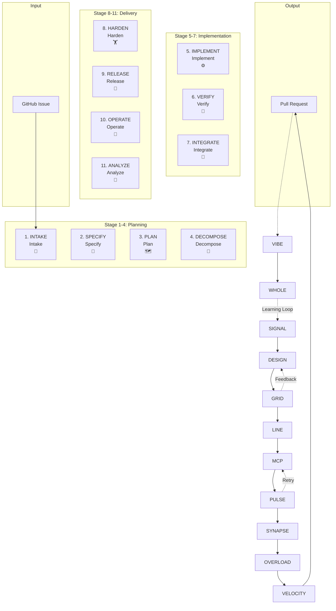

### Stage Details

| Stage | Agent | Model | Purpose |
|-------|-------|-------|---------|
| SIGNAL | Planner | GPT-5.2 | Catch initial request |
| DESIGN | Specifier | Claude Sonnet 4.5 | Expand requirements |
| GRID | Simulator | Claude Sonnet 4.5 | Monte Carlo optimization |
| LINE | Decomposer | Claude Sonnet 4.5 | Atomic task breakdown |
| MCP | Coder | Claude Sonnet 4.5 | Code generation |
| PULSE | Validator | Claude Sonnet 4.5 | Testing and validation |
| SYNAPSE | Merger | Claude Sonnet 4.5 | Integration |
| OVERLOAD | Tester | Claude Sonnet 4.5 | Hardening |
| VELOCITY | Deployer | Claude Opus 4.5 | Release preparation |
| VIBE | Operator | Gemini 3 Pro | SLO monitoring |
| WHOLE | Analyzer | Claude Opus 4.5 | Learning loop |

---

## Agent Invocation Sequence

> **Note**: The sequence diagrams below provide a simplified, high-level view of agent interaction patterns. For a comprehensive list of all 20 specialized agents and their stage assignments in the 11-stage Aether Lifecycle, see the [Complete Agent Reference](#complete-agent-reference) section below and [WORKFLOW_DIAGRAM.md](../../WORKFLOW_DIAGRAM.md#complete-workflow-pipeline).

### Standard Stage Execution

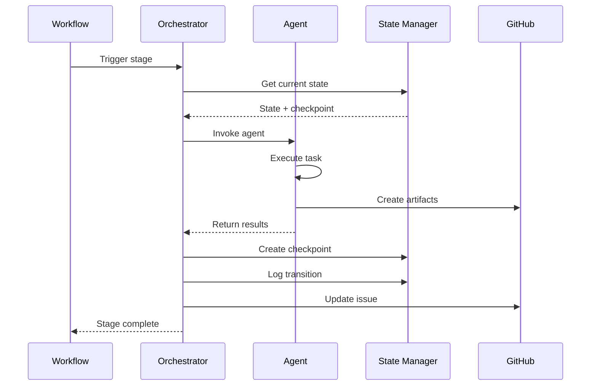

### Self-Healing Validation

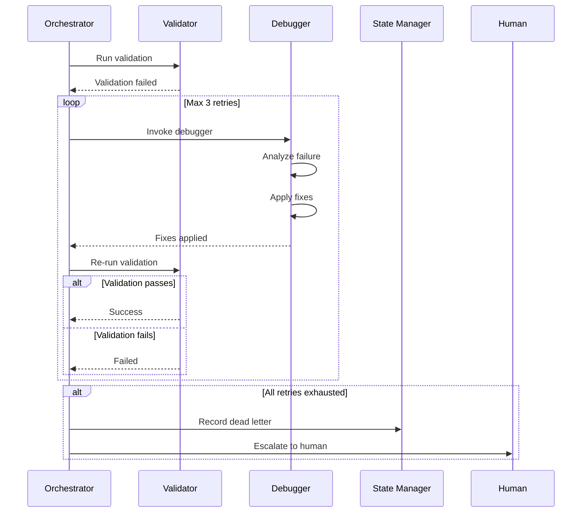

### Agent Handoff

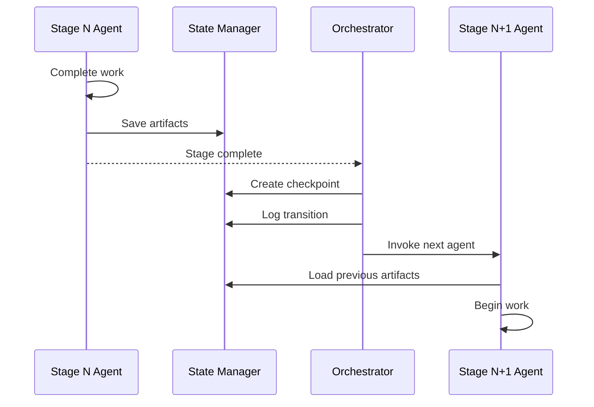

### Complete Agent Reference

The 11-stage Aether Lifecycle pipeline utilizes 20 specialized agents across different stages:

| Stage | Agents | Role |
|-------|--------|------|
| **1. INTAKE** | Triage, Advisor | Issue classification and strategic guidance |
| **2. SPECIFY** | Specifier | Requirements specification (PRD) |
| **3. PLAN** | Simulator, Architect, Planner | Monte Carlo optimization, system design, task planning |
| **4. DECOMPOSE** | Decomposer | Atomic task breakdown |
| **5. IMPLEMENT** | Implementer, Copilot | Code generation and assistance |
| **6. VERIFY** | Tester, Debugger | Testing and self-healing fixes |
| **7. INTEGRATE** | Merger, Validator | Code integration and validation |
| **8. HARDEN** | Security | Security scanning and audits |
| **9. RELEASE** | Deployer | Deployment artifacts and release management |
| **10. OPERATE** | Operator | SLO monitoring and operational health |
| **11. ANALYZE** | Analyzer, Documenter | Metrics analysis and documentation |

**Additional Supporting Agents:**
- **Orchestrator**: Runtime engine managing state transitions
- **Requirements**: Extracts and manages functional requirements (used with Specifier)
- **Reviewer**: Static analysis and code reviews (quality gate)

> **Total**: 20 specialized autonomous agents working across the 11-stage pipeline.

For detailed stage-by-stage breakdown with timing estimates and artifacts, see [WORKFLOW_DIAGRAM.md](../../WORKFLOW_DIAGRAM.md#complete-workflow-pipeline).

---

## State Management

### State File Structure

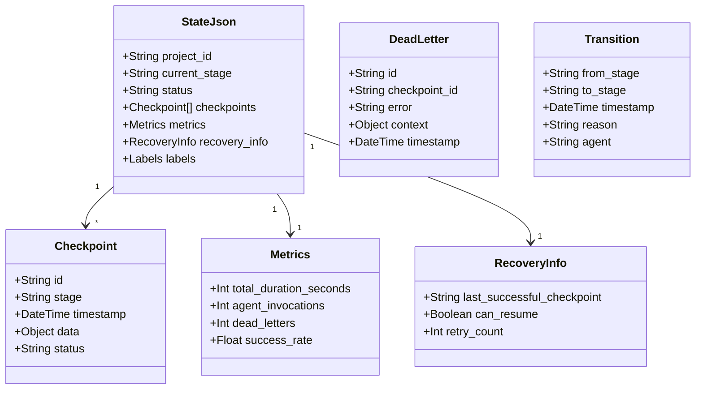

### Checkpoint Flow

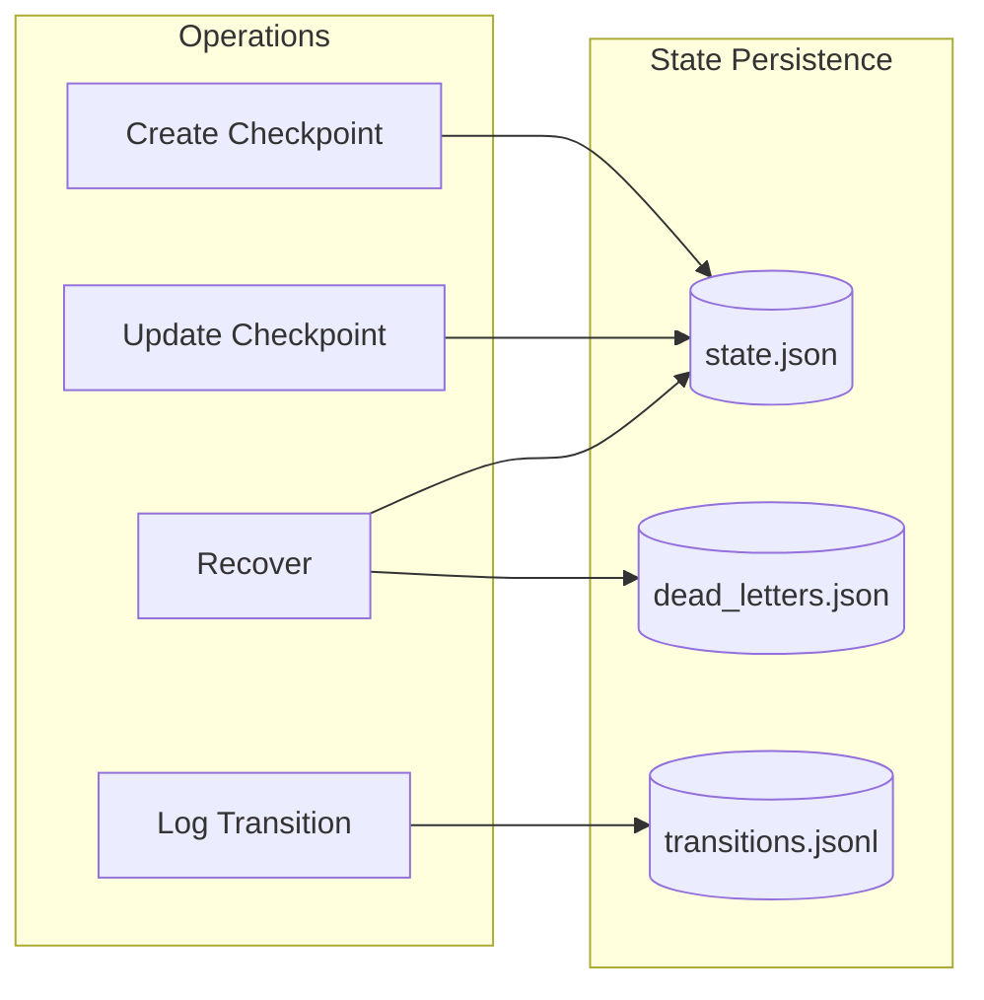

### File Locking

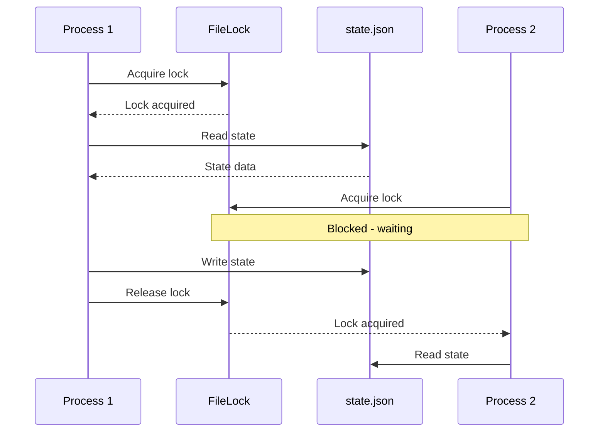

---

## Component Relationships

### Module Dependencies

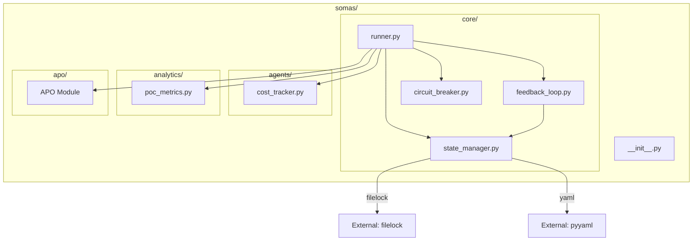

### Configuration Hierarchy

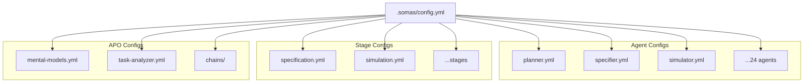

---

## APO Integration

### Task Analysis Flow

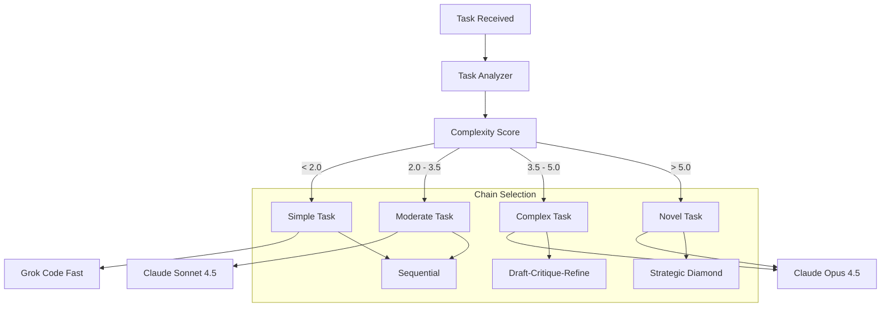

### Mental Model Selection

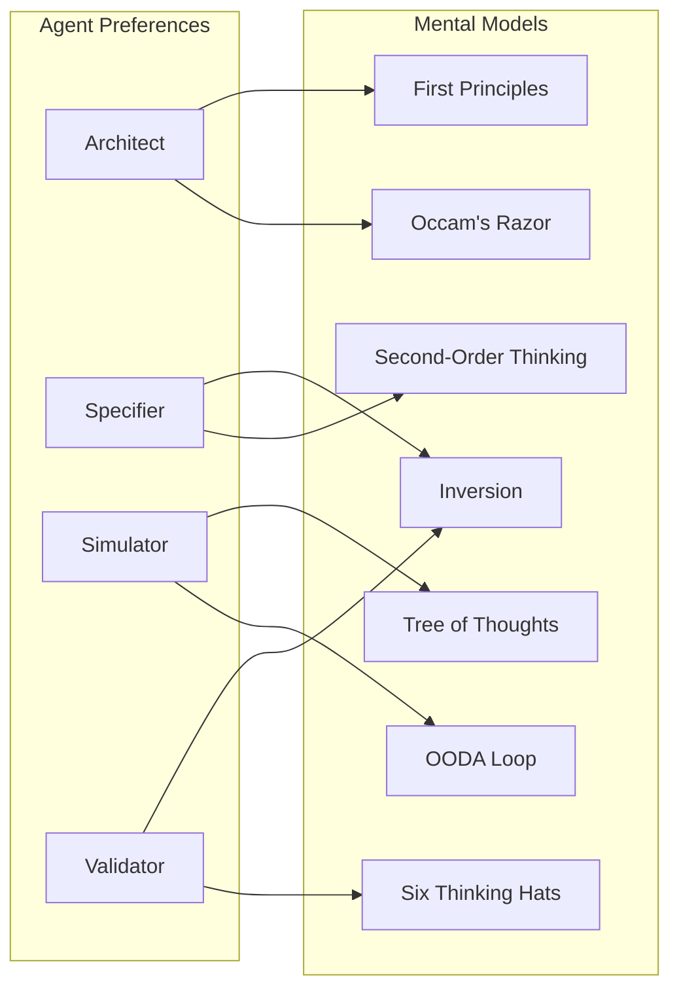

### Quality Loop

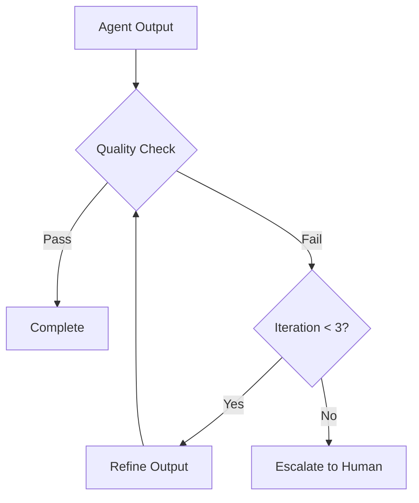

---

## Triage System Flow

### Request Classification

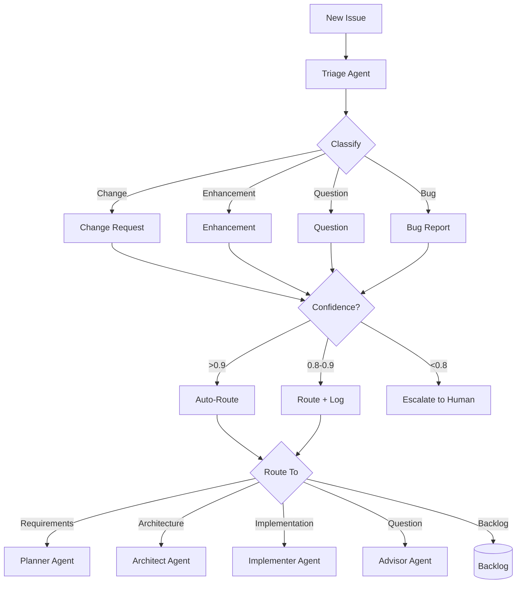

### Routing Decision Tree

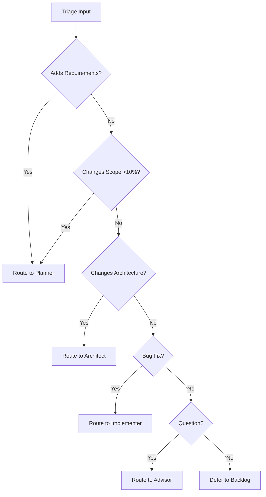

---

## Rendering Diagrams

These diagrams use [Mermaid](https://mermaid.js.org/) syntax and can be rendered:

1. **GitHub**: Automatically renders in markdown files
2. **VS Code**: Use Mermaid preview extension
3. **CLI**: Use `mmdc` (Mermaid CLI)
   ```bash
   npx @mermaid-js/mermaid-cli mmdc -i architecture-diagrams.md -o diagrams/
   ```

---

## See Also

- [Developer Guide](developer-guide.md) - Technical details
- [Configuration Reference](configuration-reference.md) - All settings
- [README](README.md) - System overview
